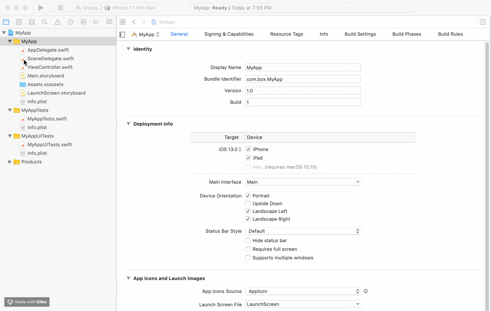
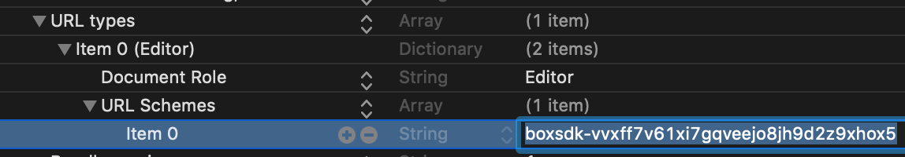

# Box iOS SDK

[](https://cocoapods.org/pods/BoxSDK)
[](https://raw.githubusercontent.com/box/box-swift-sdk/master/LICENSE) [](https://github.com/apple/swift-package-manager)
 [](https://github.com/Carthage/Carthage)
 [](https://cocoapods.org/pods/BoxSDK) [](https://travis-ci.com/box/box-swift-sdk) [](https://coveralls.io/github/box/box-swift-sdk)

NOTE:
===================

The Box iOS SDK in **Objective-C** (prior to v3.0.0) has been moved from the master branch to the [objective-c-maintenance branch](https://github.com/box/box-ios-sdk/tree/objective-c-maintenance).
Going forward, the master branch will contain the iOS SDK in **Swift**, starting with v3.0.0.

Box iOS SDK
- [Requirements](#requirements)
- [Installing the SDK](#installing-the-sdk)
  - [Carthage](#carthage)
  - [CocoaPods](#cocoapods)
  - [Swift Package Manager](#swift-package-manager)
- [Getting Started](#getting-started)
- [Sample Apps](#sample-apps)
  - [OAuth2 Sample App](#oauth2-sample-app)
  - [JWT Auth Sample App](#jwt-auth-sample-app)
- [Release Definitions](#release-definitions)
- [Copyright and License](#copyright-and-license)

<!-- END doctoc generated TOC please keep comment here to allow auto update -->


Requirements
------------------

- iOS 11.0+ / Mac OS X 10.13+ / tvOS 11.0+ / watchOS 4.0+
- Xcode 10.0+

Installing the SDK
------------------

### Carthage

__Step 1__: Add to your `Cartfile`

```
git "https://github.com/box/box-ios-sdk.git" ~> 4.0
```

__Step 2__: Update dependencies
```shell
$ carthage update --platform iOS
```

__Step 3__: Drag the built framework from Carthage/Build/iOS into your project.

For more detailed instructions, please see the [official documentation for Carthage](https://github.com/Carthage/Carthage#if-youre-building-for-ios-tvos-or-watchos).

### CocoaPods

__Step 1__: Add to your `Podfile`

```
pod 'BoxSDK', '~> 4.0'
```

__Step 2__: Install pod by running the following command in the directory with the `Podfile`

```
$ pod install
```

For more detailed instructions, please see the [official documentation for Cocoapods](https://guides.cocoapods.org/using/using-cocoapods.html).

### Swift Package Manager

#### Importing BoxSDK into Project

__Step 1__: Click on Xcode project file

__Step 2__: Click on Swift Packages and click on the plus to add a package

__Step 3__: Enter the following repository url `https://github.com/box/box-ios-sdk.git` and click next

__Step 4__: Leave the default settings to get the most recent release and click next to finish importing

The process should look like below:




#### Adding BoxSDK as a Dependency

For detailed instructions, please see the [official documentation for SPM](https://swift.org/package-manager/). 

Getting Started
---------------

To get started with the SDK, get a Developer Token from the Configuration page of your app in the
[Box Developer Console][dev-console].  You can use this token to make test calls for your own Box account.

```swift
import BoxSDK

let client = BoxSDK.getClient(token: "YOUR_DEVELOPER_TOKEN")
client.users.getCurrentUser() { result in
    switch result {
    case let .error(error):
        print("Error: \(error)")
    case let .success(user):
        print("\(user.name) (\(user.login)) is logged in")
    }
}
```

[dev-console]: https://app.box.com/developers/console

The usage docs that show how to make calls to the Box API with the SDK can be found [here](https://github.com/box/box-ios-sdk/tree/master/docs/usage).

The Jazzy docs that show class, method, variable, etc definitions can be found [here](https://opensource.box.com/box-ios-sdk/).

Sample Apps
-----------

### OAuth2 Sample App

A sample app using OAuth2 Authentication can be found in the repository [here][oauth2-sample-app].  This app demonstrates
how to use the SDK to make calls, and can be run directly by entering your own credentials to log in.

[oauth2-sample-app]:
https://github.com/box/box-ios-sdk/tree/limited-beta-release/SampleApps/OAuth2SampleApp

To execute the sample app:
__Step 1__: Run carthage
```shell
$ cd SampleApps/OAuth2SampleApp
$ carthage update --platform iOS
```

__Step 2__: Open Xcode Project File
```shell
$ open OAuth2SampleApp.xcodeproj
```

__Step 3__: Insert your client ID and client secret

First, find your OAuth2 app's client ID and secret from the [Box Developer Console][dev-console].  Then, add these
values to the sample app in the `Constants.swift` file in the sample app:
```swift
static let clientId = "YOUR CLIENT ID GOES HERE"
static let clientSecret = "YOUR CLIENT SECRET GOES HERE"
```

__Step 4__: Set redirect URL

Using the same client ID from the previous step, set the redirect URL for your application in the
[Box Developer Console][dev-console] to `boxsdk-<<YOUR CLIENT ID>>://boxsdkoauth2redirect`, where `<<YOUR CLIENT ID>>`
is replaced with your client ID.  For example, if your client ID were `vvxff7v61xi7gqveejo8jh9d2z9xhox5` the redirect
URL should be `boxsdk-vvxff7v61xi7gqveejo8jh9d2z9xhox5://boxsdkoauth2redirect`

__Step 5__: Insert your client ID to receive the redirect in the app

Open the `Info.plist` file in the sample app and find the key under `URL Types --> Item 0 --> URL Schemes --> Item 0`.
Using the same client ID from the previous step, set the value for Item 0 to
`boxsdk-<<YOUR CLIENT ID>>`, where `<<YOUR CLIENT ID>>` is replaced with your client ID.  For example, if your client
ID were `vvxff7v61xi7gqveejo8jh9d2z9xhox5` the redirect URL should be
`boxsdk-vvxff7v61xi7gqveejo8jh9d2z9xhox5`



__Step 6__: Run the sample app

### JWT Auth Sample App

A sample app using JWT Authentication can be found in the repository [here][jwt-sample-app].  This app demonstrates how to
set up JWT authentication with a remote authorization service, and will not run until you provide the code to retrieve
tokens.

[jwt-sample-app]: https://github.com/box/box-ios-sdk/tree/limited-beta-release/SampleApps/JWTSampleApp

To execute the sample app:
__Step 1__: Run carthage
```shell
$ cd SampleApps/JWTSampleApp
$ carthage update --platform iOS
```

__Step 2__: Open Xcode Project File
```shell
$ open JWTSampleApp.xcodeproj
```

__Step 3__: Insert your client ID and client secret

First, find your OAuth2 app's client ID and secret from the [Box Developer Console][dev-console].  Then, add these
values to the sample app in the `Constants.swift` file in the sample app:
```swift
static let clientId = "YOUR CLIENT ID GOES HERE"
static let clientSecret = "YOUR CLIENT SECRET GOES HERE"
```

__Step 4__: Add code for retrieving access tokens

In the `ViewController.swift` file in the sample app, edit the
`obtainJWTTokenFromExternalSources()` method:
```swift
func obtainJWTTokenFromExternalSources() -> DelegatedAuthClosure {
    return { uniqueID, completion in
        #error("Obtain a JWT Token from your own service or a Developer Token for your app in the Box Developer Console at https://app.box.com/developers/console and return it in the completion.")
        // The code below is an example implementation of the delegate function
        // Please provide your own implementation
        
        // ...
    }
}
```

__Step 5__: Run the sample app


## Release Definitions
Starting Oct 19th, 2019 the Box Swift SDK for iOS will be available for general use. This implies all Box developers will be able to use the SDK to build native iOS applications on Box. Between now and the next couple of months, we will be making frequent updates to the SDK based on feedback from our customers, and this document aims to set expectations with respect to:
1. the various release types you will see over the next few months, what they mean and how to identify them
1. support policy for each of the release types

Between now and the next couple of months, the Box Swift SDK for iOS releases will be one of the following types:
- [Release Candidate (RC)](#release-candidate-rc)
- [Current Release](#current-release)
- [Long Term Support](#long-term-support)

### Release Candidate (RC)
The initial releases of the SDK starting Oct 19th will be Release Candidate (RC). This means (1) the core functionality is present and tested, (2) additional functionality from this point on will be considered improvements or enhancements based on customer feedback. RC releases are usually more frequent (every few weeks), followed shortly by a current release. If you plan to use an RC release, we recommend:
- that you don't use it for production workloads (If that is unavoidable, we recommend upgrading to the Current Release version once it's ready.)
- that you create a plan to keep your application on the latest RC release version at all times (since older RC releases are considered "out of support" as soon as a new RC release is released)

Also, RC releases may carry breaking changes from the previous release and we advise developers to test their application adequately with the new RC release before adopting it.

The idea behind releasing RC releases is to rapidly iterate on the SDK (bug fixes, feature tweaks, etc.) to get it to a production-ready state, and typically we don't expect to have the SDK in the RC phase for more than a month.

> #### Support for RC releases
> A RC release
> - is Considered [Active](#active) when released
> - transitions to [End-of-life](#end-of-life) when the next release becomes Active


### Current Release

A Current Release is considered more stable that a Release Candidate Release and for that reason we expect less frequent releases of a Current Release. We typically expect to refresh Current Releases approximately every 3 months (could be shorter or longer depending on the criticality of the contents of the release).

A new Current Release will usually carry new functionality, bug fixes and may contain breaking changes. We will call out all breaking changes (if any) in the Release Notes section of every Current Release, and we advise developers to test their application adequately before adopting in for production use. 

A Current release is on the leading edge of our SDK development, and is intended for customers who are in active development and want the latest and greatest features.  Current releases are not intended for long-term use, and will only receive enough support after the next release becomes available to allow for a smooth transition to the new version. 


> #### Support for Current Release
> A Current Release
> - is Considered [Active](#active) when released
> - transitions to [Maintenance](#maintenance) 3 months after it becomes Active, or when the next release becomes Active, whichever is later
> - reaches [End-of-life](#end-of-life) 6 months after it becomes Active, or 3 months after the next release becomes Active, whichever is later


### Long Term Support

A Long-Term Support (LTS) release is one which we plan to guarantee compatibility with for an extended period of time.  The public interfaces of the SDK should not be changed in ways that would break customers’ application, and the release should continue to receive at least bug fixes for its entire lifecycle. We expect to refresh Long Term Release version every 18 - 24 months.

For the above reasons, we recommend all developers who do not intend to make frequent updates (~every 6 - 12 months) to their application, only use a Long Term Release version of the SDK. 

> #### Support for Long Term Release
> A Long Term Release
> - is considered [Active](#active) when released
> - transitions to [Maintenance](#maintenance) 1 year after it becomes Active, or when the next release becomes Active, whichever is later
> - reaches [End-of-life](#end-of-life) 2 years after it becomes Active, or 1 year after the next LTS release becomes Active, whichever is later


### Support Phases
#### Active
Once a release is considered ready for release, a new version is cut and the release enters the Active phase.  However, new features may be added to the SDK, including support for new API endpoints. 

#### Maintenance
After a time, the release is no longer under active development, but customers may still be depending on it.  At this time, we consider the release to be in Maintenance phase; generally, only bug fixes will be considered for inclusion in new versions.  We may of course opt to include new functionality based on customer demand, but in general customers should expect that the SDK feature set will be mostly frozen for the remainder of its lifecycle.

#### End-of-life
After a release is no longer being supported by Box, it enters End-of-life (EOL) and no further changes should be expected by customers.  Customers must upgrade to a newer release if they want to receive support.


Copyright and License
-------

Copyright 2019 Box, Inc. All rights reserved.

Licensed under the Apache License, Version 2.0 (the "License"); you may not use this file except in compliance with the License. You may obtain a copy of the License at

http://www.apache.org/licenses/LICENSE-2.0

Unless required by applicable law or agreed to in writing, software distributed under the License is distributed on an "AS IS" BASIS, WITHOUT WARRANTIES OR CONDITIONS OF ANY KIND, either express or implied. See the License for the specific language governing permissions and limitations under the License.
